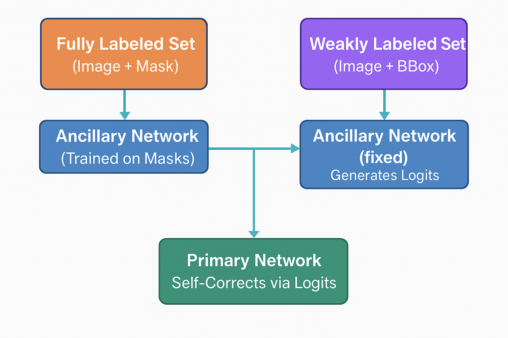

# Semi-Supervised Semantic Segmentation with Self-Correcting Networks (Reimplementation)

📚 **Paper Reproduced:**  
**Ibrahim et al., CVPR 2020**  
["Semi-Supervised Semantic Segmentation with Self-Correcting Networks"](https://openaccess.thecvf.com/content_CVPR_2020/html/Ibrahim_Semi-Supervised_Semantic_Segmentation_With_Self-Correcting_Network_CVPR_2020_paper.html)

---

## 🚀 Pipeline Overview
Reproduces the CVPR 2020 pipeline for **semi-supervised semantic segmentation** on VOC 2012.

**Core Steps:**
1️⃣ Fully-Labeled Set: Images + masks  
2️⃣ Weak Set: Images + bounding box heatmaps  
3️⃣ Ancillary Model: Trained on fully-labeled data  
4️⃣ Generate Ancillary Logits for Weak Set  
5️⃣ Primary Model: Trained on fully-labeled + weak logits (self-correction)  
6️⃣ Evaluation: Reports **mean IoU (mIoU)** on VOC 2012 validation set  

---
## 📊 Pipeline Diagram


## 📂 Project Structure
```
datasets/
    fully_labeled_dataset.py
    weak_dataset.py
    weak_logits_dataset.py
models/
    unet.py
train/
    train_ancillary.py
    generate_logits.py
    train_primary.py
evaluate/
    evaluate_primary.py
utils/
    voc_utils.py
    metrics.py
outputs/
    ancillary_logits/
    saved_models/
main.py
requirements.txt
README.md
```

---

## 📊 Evaluation Metric
- **Mean Intersection over Union (mIoU)**
- Per-class IoU for VOC 2012 (21 classes including background)

---

## 📥 Installation
```bash
pip install -r requirements.txt
```

**requirements.txt**
```
torch
torchvision
opencv-python
numpy
matplotlib
tqdm
Pillow
```

---

## 🛠️ How to Run the Full Pipeline
### 🔧 Recommended (One Command):
```bash
python main.py
```

---

## 🔧 Run Manually (Step-by-Step)
```bash
python train/train_ancillary.py         # 1️⃣ Train Ancillary Model
python train/generate_logits.py         # 2️⃣ Generate Ancillary Logits
python train/train_primary.py           # 3️⃣ Train Primary Model with Self-Correction
python evaluate/evaluate_primary.py     # 4️⃣ Evaluate Primary Model (mIoU)
```


---

## 📝 Key Implementation Details
| Component        | Description                               |
|------------------|-------------------------------------------|
| **Model**        | U-Net (4 input channels: RGB + bbox heatmap) |
| **Ancillary Loss** | CrossEntropyLoss (ignore_index=255)       |
| **Primary Loss** | Fully-labeled: CrossEntropy / Weak: KLDiv  |
| **Alpha Schedule** | Linear decay (30.0 ➔ 0.5)                 |

---

## 📄 License
For academic and research purposes only.  
Original method by **Ibrahim et al., CVPR 2020**.

---

## 🙋 Acknowledgments
Thanks to the original authors for their impactful work.  
This reimplementation serves educational and reproducibility purposes.

---

## 📧 Contact
For questions, reach out via GitHub issues or email.
